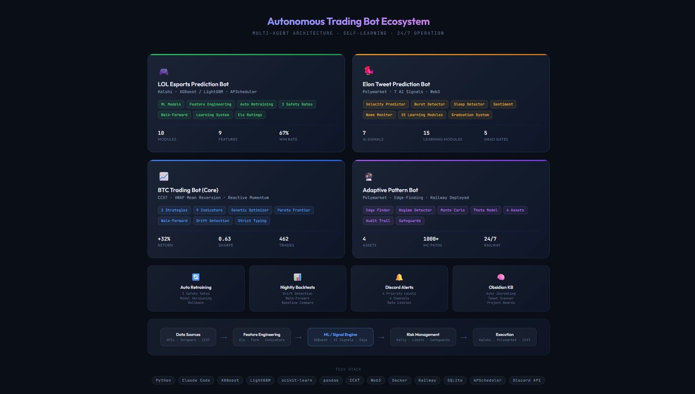
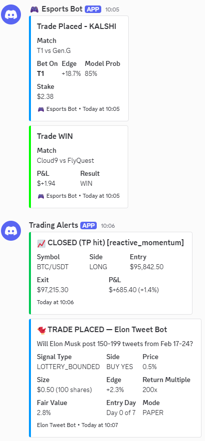
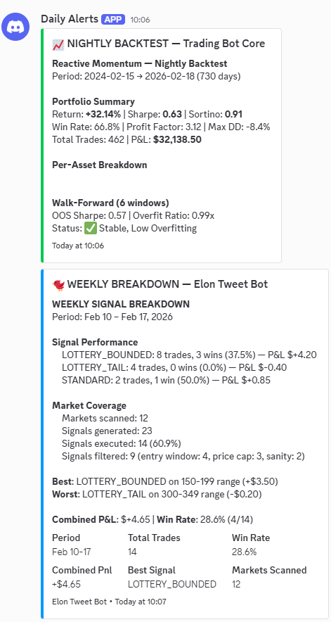
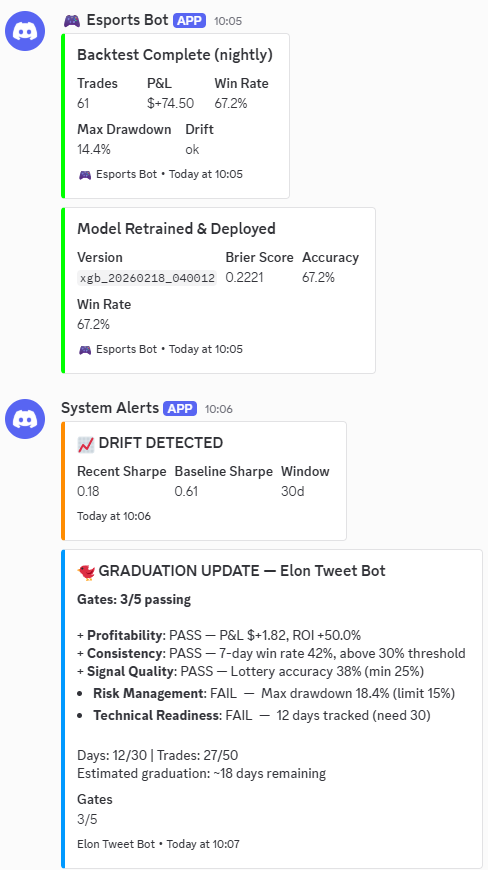

# Autonomous Trading Bot Ecosystem

> 4 production AI systems running 24/7 — built with Claude Code and Python

I design and build autonomous trading bots that collect data, train their own models, make decisions, manage risk, and report results — all without human intervention.

---

## Architecture

---

## The Bots

### 🎮 Esports Prediction Bot
ML-powered prediction system trading esports matches on Kalshi.

- XGBoost/LightGBM ensemble with SHAP feature importance
- Automated data collection pipeline (6-hour schedule)
- Automated model retraining with 3 safety gates (performance, calibration, profitability)
- Model version archive with one-command rollback
- Walk-forward validation to prevent overfitting
- Nightly backtesting with drift detection

### 🐦 Multi-Signal Tweet Prediction Bot
Combines 7+ AI signal modules into trading decisions on Polymarket.

- Signal modules: velocity prediction, sentiment analysis, pattern detection, sleep schedule modeling, news monitoring
- Multi-signal aggregation engine
- Self-learning system with 15 sub-modules that adapt based on outcomes
- Paper trading engine with 5-gate graduation system
- Automated graduation from paper → live trading

### 📈 Dual-Strategy BTC Trading Bot
Two strategies that switch automatically based on market conditions.

- VWAP Mean Reversion for range-bound markets
- Reactive Momentum for trending markets
- 9 custom technical indicators
- Multi-objective optimization with genetic algorithm and Pareto frontier
- Walk-forward validation with out-of-sample Sharpe tracking
- 24/7 deployment on Railway with Docker

### 🔮 Adaptive Pattern Bot
Edge-finding system for prediction markets deployed on Railway.

- 4-asset coverage with Monte Carlo simulation
- Regime detection and adaptive parameter tuning
- Full audit trail for every decision
- Deployed 24/7 on Railway

---

## Shared Infrastructure

All bots share a common infrastructure layer:

**Automated Retraining** — 3 safety gates, model versioning, one-command rollback

**Nightly Backtests** — Drift detection, walk-forward validation, baseline comparison

**Discord Alert System** — 4 channels with priority-based routing and rate limiting

**Health Dashboard** — Live web dashboard, Obsidian integration, Discord summaries

**Obsidian Knowledge Base** — Auto-journaling, project boards, learning roadmap

---

## Live System Output

### Trade Execution & Results

### Automated Daily Reports

### System Monitoring & Model Retraining

---

## Tech Stack

| Category | Tools |
|----------|-------|
| **Language** | Python |
| **AI Development** | Claude Code, Anthropic API |
| **ML Models** | XGBoost, LightGBM, scikit-learn |
| **Data** | pandas, NumPy, SQLite |
| **Scheduling** | APScheduler |
| **Trading** | CCXT, Web3 |
| **Deployment** | Docker, Railway |
| **Monitoring** | Discord webhooks, custom health dashboard |
| **Knowledge Management** | Obsidian |
| **APIs** | REST, webhooks, web scraping |

---

## About Me

Finance student at UNC Charlotte building autonomous systems with Claude Code and Python. I focus on production-grade reliability — self-healing processes, safety gates, kill switches, and comprehensive monitoring.

**Upwork:** [Available for AI agent and bot development projects](https://www.upwork.com/freelancers/~01ad41f1eeb3c9f671)
**Email:** gglinder16@gmail.com

---

*All bots are private repositories. This portfolio showcases architecture and results — source code is not publicly available.*
